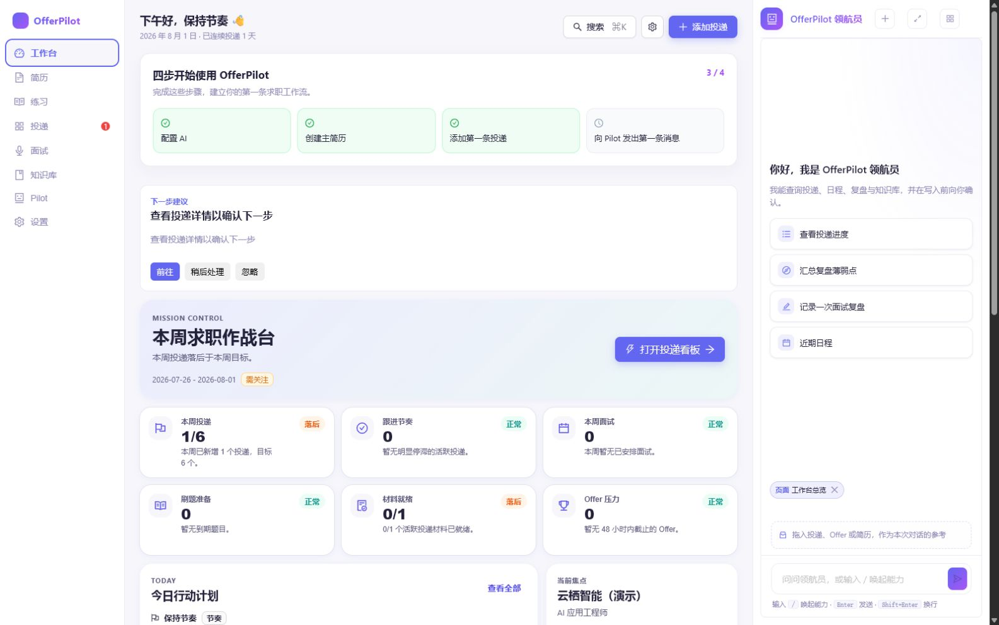
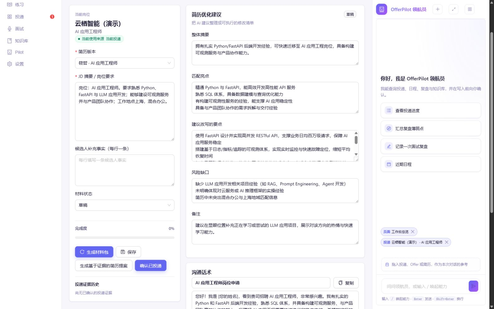
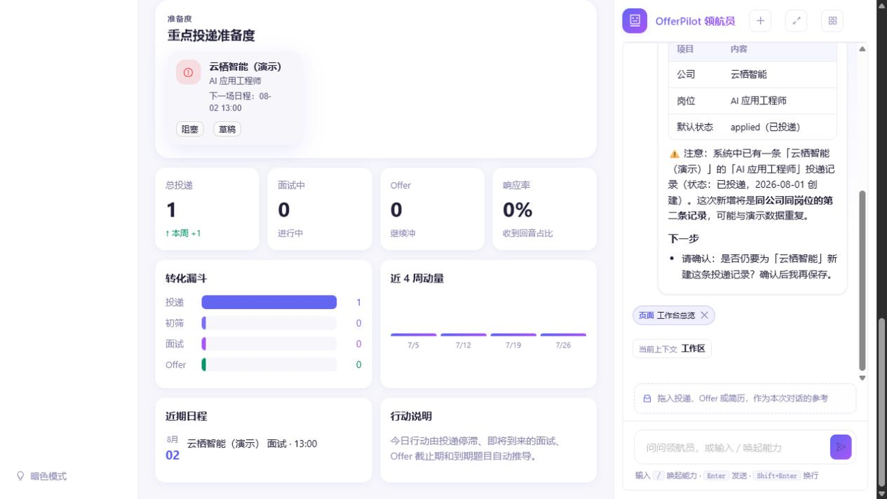
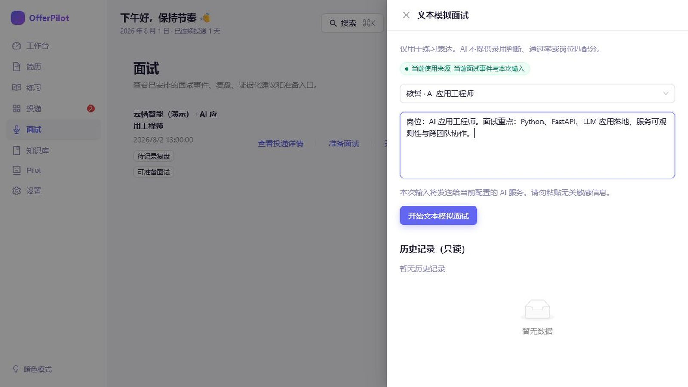
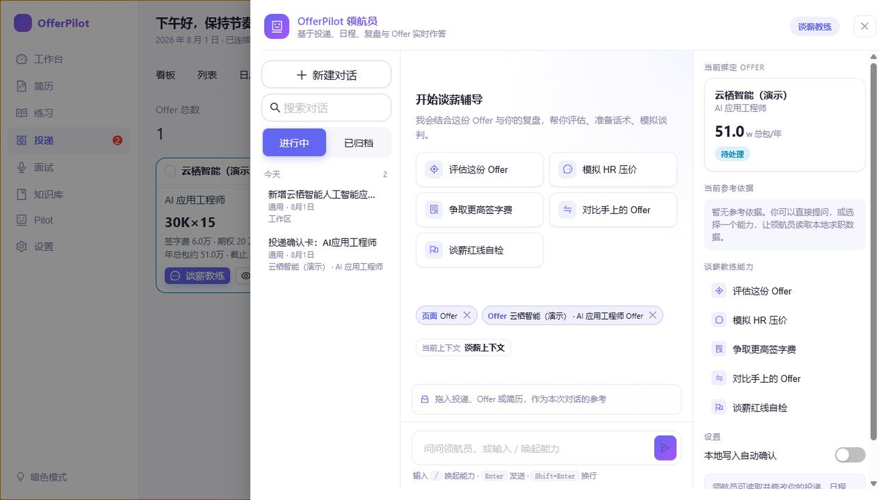

# OfferPilot — 本地优先的 AI 求职工作台

> 把简历、投递、面试与 Offer 放在一个由你掌控的本地工作台；AI 提供建议，你决定下一步。

OfferPilot 面向正在认真找工作的普通求职者。它将分散的简历、岗位信息、面试安排、复盘和 Offer 事实整理到本地 SQLite 工作区中，并在需要时由你配置的 AI 服务协助分析与起草。

## 它能帮你做什么

- **管理简历与投递**：保留简历版本、记录岗位、公司、状态与日程。
- **评估岗位匹配、准备投递材料**：基于你提供的简历和岗位信息，生成可审阅的匹配分析与材料建议。
- **准备面试、进行文本模拟与复盘**：围绕已安排的面试准备问题、进行练习，并把确认后的经验沉淀下来。
- **汇总已确认的经验与知识**：将你确认保留的复盘内容整理进知识库，方便下一次准备时查阅。
- **比较 Offer 已知事实，准备谈薪沟通**：查看薪酬、福利、截止日等已知信息，并准备下一次沟通。

## 真实界面

以下截图来自本地亮色模式的中文演示案例（候选人：筱哲）。它们展示的是实际页面与实际操作路径，不是设计稿。

### 1. 从工作台看到当前节奏

工作台将投递进展、近期面试和待办放在一起；建议卡只引导你前往已有入口，不会自动替你执行操作。



### 2. 围绕一条投递准备材料

在投递详情中选择简历、填写岗位信息后，可以生成可逐项审阅的材料建议。原始简历不会被静默覆盖。



### 3. Pilot 有何不同

Pilot 可以读取你当前授权的本地上下文，协助查询、整理或起草下一步；涉及写入时，它先给出确认卡或草稿，等待你确认。它不会绕过你的确认去保存投递、发送消息或代表你作决定。



### 4. 面试前练习，面试后复盘

从已安排的面试进入文本模拟面试，使用选定简历和岗位信息练习；反馈与复盘仍由你审阅和确认。



### 5. Offer 与谈薪

录入单个 Offer 后即可进入谈薪教练，准备评估、开场话术、HR 压价模拟或签字费沟通。多 Offer 对比只整理已知事实，最终选择仍由你决定。



## 快速开始

### Docker

```bash
docker build -t offerpilot .
docker run --rm -p 8080:8080 -v offerpilot-data:/data offerpilot
```

打开 `http://localhost:8080`。

### 从源码启动

```bash
git clone https://github.com/offercontext/offerpilot.git
cd offerpilot
uv sync
cd web && npm ci && npm run build
cd ..
uv run oc start
```

默认数据与配置位于 `~/.offerpilot`；可使用 `OFFERPILOT_DATA` 指定其他数据目录。

## 隐私与边界

- OfferPilot 默认在本地运行，数据保存在本地 SQLite 工作区。
- 需要 AI 时，使用你自己配置的 Provider 与密钥；发送给模型的内容由对应功能的页面提示与确认边界约束。
- **不自动投递**、不代表你发送外部消息，也不在未确认的情况下写入关键求职数据。
- AI 给出的是可解释、可审阅的建议；OfferPilot **不替用户决定**是否投递、接受 Offer 或如何谈薪。

## English

OfferPilot is a local-first AI job-search workspace for keeping resumes, applications, interviews, confirmed learnings, and offers together. It helps you prepare and review; you keep control of every important action.

Start from source with `uv sync`, build the web app with `npm ci && npm run build`, then run `uv run oc start`. Data is stored locally in SQLite by default. OfferPilot does not auto-apply, send external messages, or decide which offer you should accept.

## 许可证

[AGPLv3](LICENSE)
