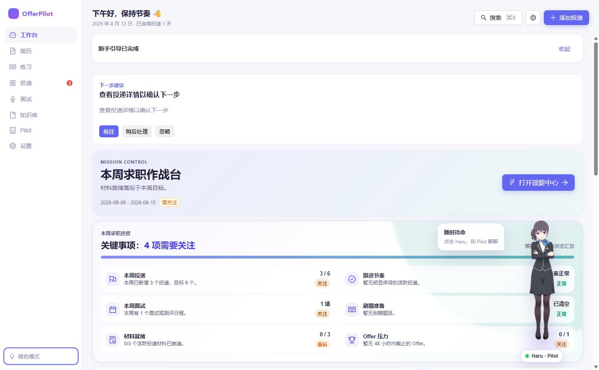
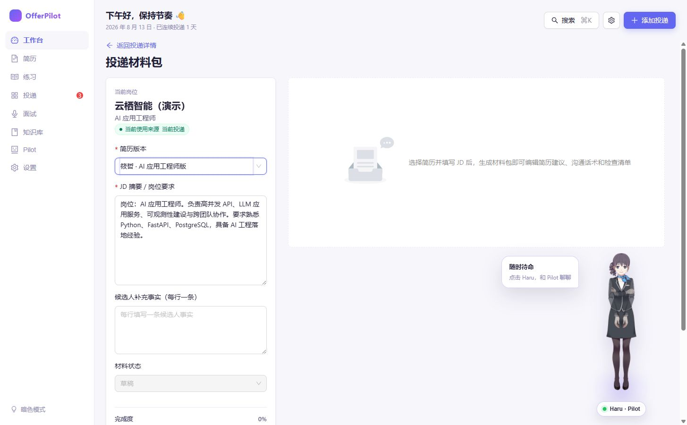
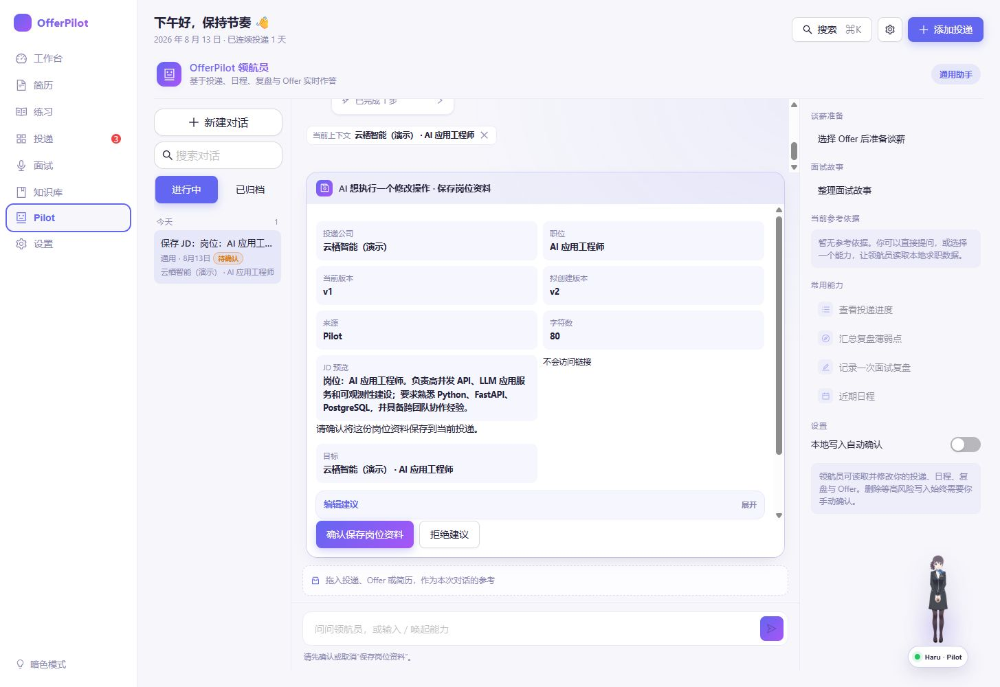
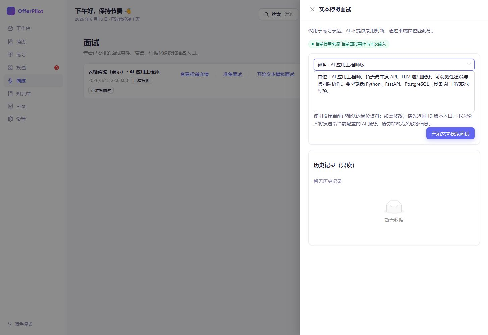
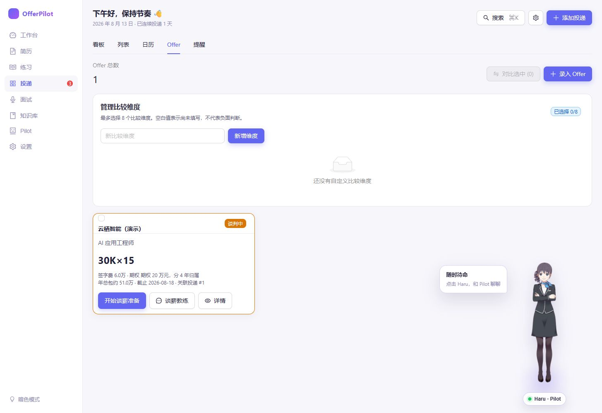

# OfferPilot — 本地优先的 AI 求职工作台

> 把简历、投递、面试与 Offer 放在一个由你掌控的本地工作台；AI 提供建议，你决定下一步。

OfferPilot 面向正在认真找工作的普通求职者。它将分散的简历、岗位信息、面试安排、复盘和 Offer 事实整理到本地 SQLite 工作区中，并在需要时由你配置的 AI 服务协助分析与起草。

## 它能帮你做什么

- **管理简历与投递**：保留简历版本、记录岗位、公司、状态与日程。
- **评估岗位匹配、准备投递材料**：基于你提供的简历和岗位信息，生成可审阅的匹配分析与材料建议。
- **准备面试、进行文本模拟与复盘**：围绕已安排的面试准备问题进行练习；支持文字与可选语音输入，语音转写结果需先确认。
- **汇总已确认的经验与知识**：将你确认保留的复盘内容整理进知识库，方便下一次准备时查阅。
- **比较 Offer 已知事实，准备谈薪沟通**：查看薪酬、福利、截止日等已知信息，并准备下一次沟通。
- **随时唤起 Pilot**：桌面宽屏可通过 Haru 看板娘打开 Pilot；隐藏角色后仍可使用默认 Pilot 侧边栏。

## 真实界面

以下截图来自本地亮色模式的中文演示案例（候选人：筱哲）。它们展示的是实际页面与实际操作路径，不是设计稿。

### 1. 从工作台看到当前节奏

工作台将本周求职节奏、下一步建议和今日行动放在一起；Haru 会在桌面宽屏陪伴，但不会自动替你执行操作。



### 2. 围绕一条投递准备材料

在投递详情中选择岗位简历版本、确认当前 JD 后，可以进入材料工作区生成并逐项审阅建议。原始简历不会被静默覆盖。



### 3. Pilot 有何不同

Pilot 可以读取你当前授权的本地上下文，协助查询、整理或起草下一步；涉及写入时，它先给出确认卡或草稿，等待你确认。Haru 可提示后台回复已经完成，隐藏角色后则恢复默认 Pilot 侧边栏。



### 4. 面试前练习，面试后复盘

从已安排的面试进入文本模拟面试，明确选择岗位简历版本并冻结当前 JD 后开始练习；反馈与复盘仍由你审阅和确认。



### 5. Offer 与谈薪

录入 Offer 后可以查看已知薪酬事实、补充自定义比较维度，并进入谈薪准备或谈薪教练。多 Offer 对比只整理已知事实，最终选择仍由你决定。



## 快速开始

### Docker

```bash
docker build -t offerpilot .
docker run --rm -p 8080:8080 -v offerpilot-data:/data offerpilot
```

打开 `http://localhost:8080`。

### 从源码启动

```bash
git clone https://github.com/offercontext/offerpilot.git
cd offerpilot
uv sync
cd web && npm ci && npm run build
cd ..
uv run oc start
```

默认数据与配置位于 `~/.offerpilot`；可使用 `OFFERPILOT_DATA` 指定其他数据目录。

## 隐私与边界

- OfferPilot 默认在本地运行，数据保存在本地 SQLite 工作区。
- 模拟面试录音只存在于当前页面，不上传、不持久化；离线 Whisper 模型仅在你主动点击后从 Hugging Face 下载到浏览器缓存。
- 需要 AI 时，使用你自己配置的 Provider 与密钥；发送给模型的内容由对应功能的页面提示与确认边界约束。
- **不自动投递**、不代表你发送外部消息，也不在未确认的情况下写入关键求职数据。
- AI 给出的是可解释、可审阅的建议；OfferPilot **不替用户决定**是否投递、接受 Offer 或如何谈薪。

## English

OfferPilot is a local-first AI job-search workspace for keeping resumes, applications, interviews, confirmed learnings, and offers together. It helps you prepare and review; you keep control of every important action.

Start from source with `uv sync`, build the web app with `npm ci && npm run build`, then run `uv run oc start`. Data is stored locally in SQLite by default. OfferPilot does not auto-apply, send external messages, or decide which offer you should accept.

## 许可证

[AGPLv3](LICENSE)

### 第三方角色与运行时

桌面宽屏的 Pilot 看板娘使用 Live2D 官方样例角色 Haru 受付版与 Cubism Core。相关角色、模型数据及运行时版权归 Live2D Inc. 所有，不包含在 OfferPilot 的 AGPLv3 授权中；使用与分发需同时遵守 [Live2D 样例模型条款](https://www.live2d.com/eula/live2d-sample-model-terms_en.html) 与 [Live2D SDK 许可](https://www.live2d.com/en/sdk/license/)。

> This content uses sample data owned and copyrighted by Live2D Inc. The sample data are utilized in accordance with terms and conditions set by Live2D Inc. This content itself is created at the author’s sole discretion.

### 离线语音模型与运行时

可选离线转写使用 Apache-2.0 许可的 `@huggingface/transformers`、ONNX Runtime Web 与 [`onnx-community/whisper-small`](https://huggingface.co/onnx-community/whisper-small)。模型固定到 revision `461d552a09349d5d0d0779b40dd79800eaa3e35a`，不会提交到 Git 仓库或打入模型权重；用户主动下载后仅缓存在当前浏览器。详细说明见 [`web/public/offline-whisper-NOTICE.md`](web/public/offline-whisper-NOTICE.md)。
